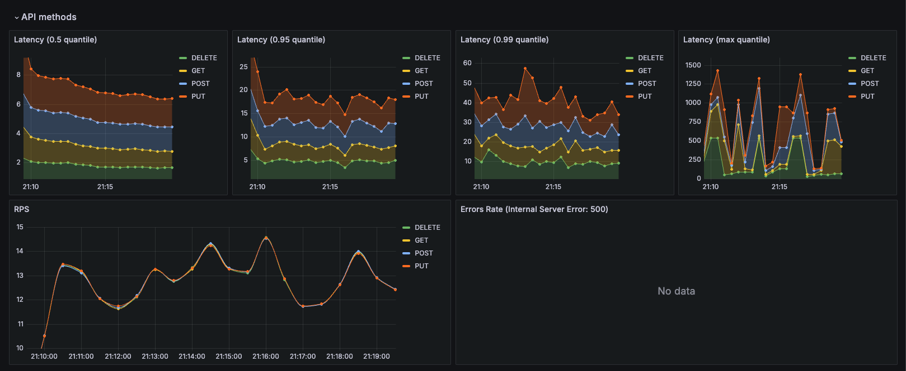
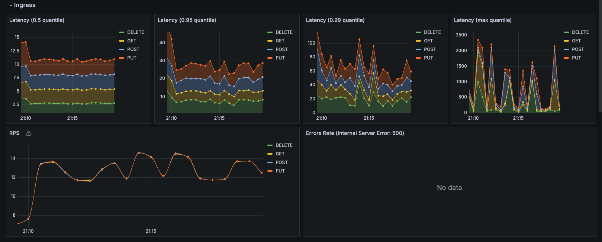
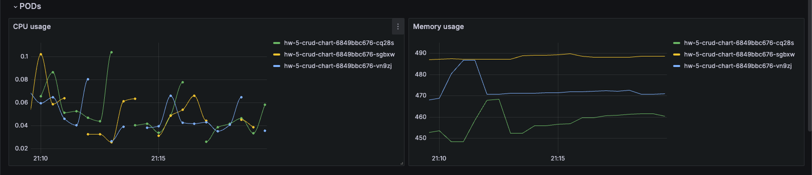

### Инструкции

1. отключаем встроенный _ingress_
    ```console
    minikube addons disable ingress 
    ```

    <br>

2. создаем _namespace-ы_ и необходимые _repo_ для helm
    ```console
    kubectl create namespace crud-app
    kubectl create namespace monitoring
    helm repo add prometheus-community https://prometheus-community.github.io/helm-charts
    helm repo add ingress-nginx https://kubernetes.github.io/ingress-nginx
    helm repo update
    ```

    <br>

3. устанавливаем _Prometheus_, _Grafana_, оператор, указав манифесты: 
    - [prometheus.yaml](prometheus/prometheus.yaml) 
    - [nginx-ingress.yaml](nginx-ingress/nginx-ingress.yaml)
    ```console
    helm install stack prometheus-community/kube-prometheus-stack -n monitoring -f ./prometheus/prometheus.yaml 
    helm install nginx ingress-nginx/ingress-nginx -f ./nginx-ingress/nginx-ingress.yaml --atomic
    ```

    <br>

4. прокидываем порты, чтобы посмотреть _UI_ для _Prometheus_ и _Grafana_
    > в отдельной вкладке/окне консоли \
    `admin: prom-operator` - логин и пароль для _Grafana_
    
    ```console
    kubectl port-forward -n monitoring service/prometheus-operated 9090
    kubectl port-forward -n monitoring service/stack-grafana 9000:80
    ```
   
    <br>

5. команда установки приложения из _Helm_
    ```console
    helm upgrade --install -n crud-app <release> ./crud-chart --atomic
    ```

   <br>

6. не забываем про _tunnel_
   > в отдельной вкладке/окне консоли 

    ```console
    minikube tunnel
    ```
   
   <br>  
 
7. теперь можем эмитировать нагрузку
   ```console
   newman run -n8000 ./postman-test/otus_microservices_hw5.postman_collection.json
    ```
   
   <br>

8. после получаем результат в _Grafana_ 
    
       
    